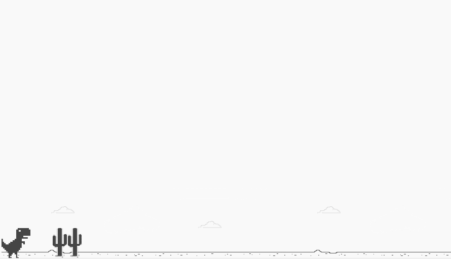

# Chrome Offline Dinosaur Game

This app is my build of Chrome's offline mode Dinosaur Game. Made with HTML, Javascript, and CSS.

Screenshot of application:

Live link, [here](https://nard1n.github.io/chrome-trex-game)

## Table of Contents

* [Installation](#Installation)
* [Usage](#Usage)
* [Contributing](#Contributing)
* [Tests](#Tests)
* [License](#License)
* [Questions](#Questions)

## Installation
Feel free to clone the repo or reference the code and simply run it in your browser

## Usage
For practicing vanilla js (focus on nodes, adding/removing children to parents with appendChild() and removeChild()).

## Contributing
Contributions to any opensource projects are amazing! If you would like to reach out about any questions or comments, please do.

## Tests
n/a

## License
This project is released under MIT opensource license:

https://opensource.org/licenses/MIT

## Questions
For more about my work, check out my Github profile: https://github.com/nard1n

If you have any questions and would like to chat, please feel free to send me an email directly to nardincodes@gmail.com
